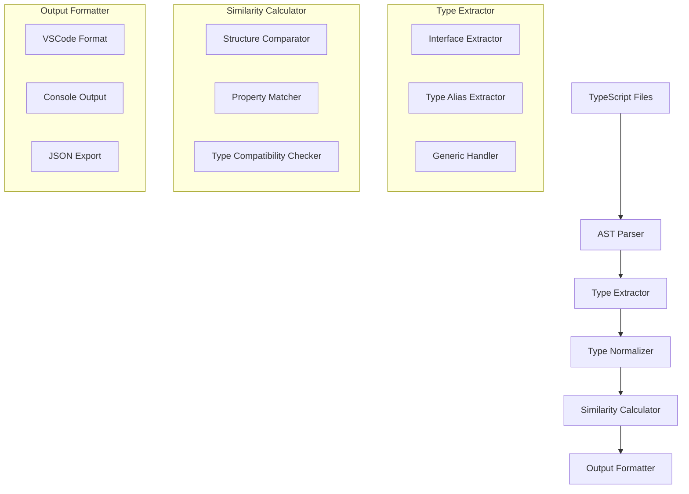
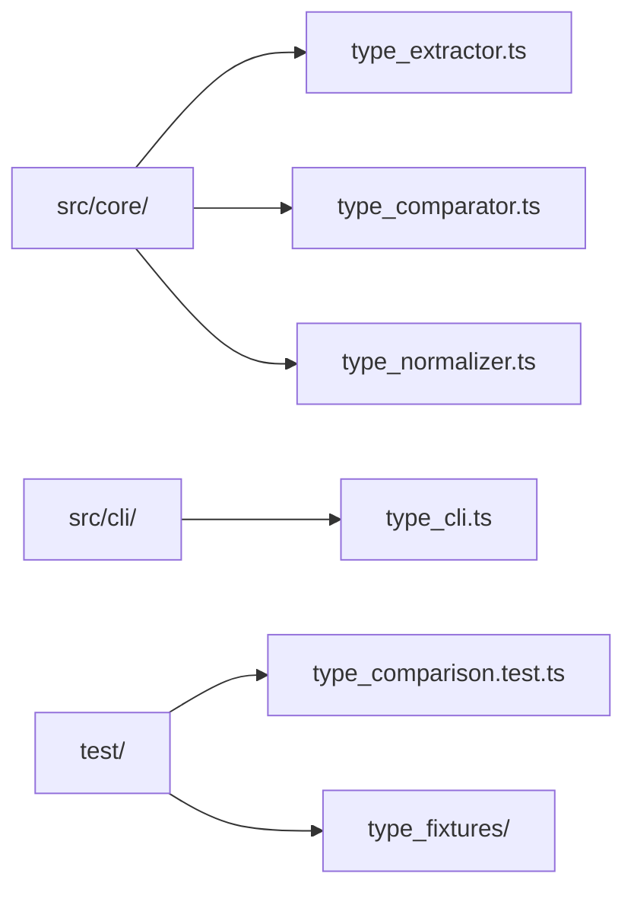

# TypeScript 型定義類似性比較機能 - 設計書

## 📋 概要

既存の関数比較機能に加えて、TypeScript の `type` と `interface` 宣言の構造的類似性を評価する機能を追加します。

## 🎯 設計目標

1. **既存機能との統合**: 関数比較と同様のワークフローで動作
2. **段階的実装**: 基本型から始めて複雑な型へ拡張
3. **柔軟な類似性評価**: プロパティ順序や命名の違いを許容
4. **VSCode 互換出力**: `similar-type:` ラベル付きコンソール出力

## 🏗️ アーキテクチャ設計



## 📁 ファイル構成



## 🔧 実装計画

### Phase 1: 基本型定義抽出 (Week 1-2)

**新規ファイル**: `src/core/type_extractor.ts`

```typescript
export interface TypeDefinition {
  name: string;
  kind: "interface" | "type";
  properties: PropertyDefinition[];
  generics?: string[];
  extends?: string[];
  ast: any;
  startLine: number;
  endLine: number;
  filePath: string;
}

export interface PropertyDefinition {
  name: string;
  type: string;
  optional: boolean;
  readonly?: boolean;
}
```

**主要機能**:

- `interface` 宣言の抽出
- `type` エイリアスの抽出
- プロパティとその型情報の解析
- ジェネリクスパラメータの抽出

### Phase 2: 型正規化とマッチング (Week 2-3)

**新規ファイル**: `src/core/type_normalizer.ts`

```typescript
export interface NormalizedType {
  properties: Map<string, string>; // プロパティ名 -> 型
  optionalProperties: Set<string>;
  readonlyProperties: Set<string>;
  signature: string; // 正規化された型シグネチャ
}

export function normalizeType(typeDef: TypeDefinition): NormalizedType;
export function calculatePropertySimilarity(
  prop1: string,
  prop2: string
): number;
```

**主要機能**:

- プロパティ順序の正規化
- 型名の正規化（`string` vs `String`など）
- プロパティ名の類似性計算（Levenshtein 距離ベース）

### Phase 3: 類似性評価アルゴリズム (Week 3-4)

**新規ファイル**: `src/core/type_comparator.ts`

```typescript
export interface TypeComparisonResult {
  similarity: number;
  structuralSimilarity: number;
  namingSimilarity: number;
  differences: {
    missingProperties: string[];
    extraProperties: string[];
    typeMismatches: Array<{ property: string; type1: string; type2: string }>;
    optionalityDifferences: string[];
  };
}

export function compareTypes(
  type1: TypeDefinition,
  type2: TypeDefinition,
  options?: TypeComparisonOptions
): TypeComparisonResult;
```

**類似性計算式**:

```
総合類似性 = (構造類似性 × 0.6) + (命名類似性 × 0.4)

構造類似性 = (共通プロパティ数 × 2) / (type1プロパティ数 + type2プロパティ数)
命名類似性 = Σ(プロパティ名類似度) / プロパティ数
```

### Phase 4: CLI 統合 (Week 4-5)

**既存ファイル拡張**: `src/cli/cli.ts`

新しいオプション追加:

```bash
similarity-ts ./src --include-types
similarity-ts ./src --types-only
similarity-ts ./src --type-threshold 0.8
```

**出力フォーマット**:

```
🔍 TypeScript Type Similarity Analyzer

Found 15 similar type pairs:

🔴 Very High Similarity (≥90%):
  ├─ interface User in models/user.ts:5
  └─ interface Person in models/person.ts:12
     92.5% similar

🟡 High Similarity (80-90%):
  ├─ type ApiResponse<T> in api/types.ts:8
  └─ interface Response in utils/http.ts:15
     85.3% similar
```

### Phase 5: ユニオン型・インターセクション型対応 (Week 5-6)

**拡張機能**:

- ユニオン型 (`"active" | "inactive"`) の解析
- インターセクション型 (`A & B`) の解析
- 複合型の類似性評価

## 🧪 テスト戦略

### テストケース設計

**基本類似性テスト**:

```typescript
// 高類似度 (90%+)
interface User {
  id: string;
  name: string;
}
interface Person {
  id: string;
  name: string;
}

// 中類似度 (70-90%)
interface User {
  id: string;
  name: string;
}
interface Person {
  id: string;
  fullName: string;
}

// 低類似度 (<70%)
interface User {
  id: string;
  name: string;
}
interface Product {
  sku: string;
  price: number;
}
```

**異種比較テスト**:

```typescript
type UserType = { id: string; name: string };
interface UserInterface {
  id: string;
  name: string;
}
// 期待値: 95%+ 類似
```

## 🔄 既存機能との統合

### 1. パーサー統合

既存の `parseTypeScript` 関数を活用

### 2. AST 走査統合

既存の `traverseAST` インフラを拡張

### 3. 出力統合

既存の関数比較結果と型比較結果を統合表示

## 📊 パフォーマンス考慮事項

### メモリ使用量対策

- 既存の APTED 実装にメモリリーク問題があるため、型比較では軽量なアルゴリズムを使用
- 大量の型定義がある場合のバッチ処理最適化

### 処理速度最適化

- 型シグネチャのハッシュ化による高速比較
- 明らかに異なる型の早期除外

## 🚀 実装優先順位

1. **高優先度**: 基本的な interface/type 抽出と比較
2. **中優先度**: ユニオン型・インターセクション型対応
3. **低優先度**: ジェネリクス、条件型、マップ型対応

## 📝 成果物

1. **コア機能**:

   - `src/core/type_extractor.ts`
   - `src/core/type_comparator.ts`
   - `src/core/type_normalizer.ts`

2. **CLI 統合**:

   - `src/cli/cli.ts` の拡張

3. **テスト**:

   - `test/type_comparison.test.ts`
   - テストフィクスチャファイル群

4. **ドキュメント**:
   - API 仕様書
   - 使用例とベストプラクティス

## 🎯 要件詳細

### 類似性評価基準

- プロパティの順序や命名が異なっても、型の構造が同じ場合は類似と判定
- プロパティ名が 80%以上一致し、型構造が類似している場合も類似と判定
- `type` と `interface` 間の比較も対応

### 対応する型定義

- 基本的なオブジェクト型とプリミティブ型
- ユニオン型とインターセクション型
- 段階的実装により、後から複雑な型定義も追加

### 出力形式

- VSCode 互換の `similar-type:` ラベル付きコンソール出力
- 既存の関数比較機能と統合されたワークフロー

この設計により、既存の関数比較機能と一貫性を保ちながら、TypeScript 型定義の構造的類似性を効果的に評価できる機能を段階的に実装できます。
