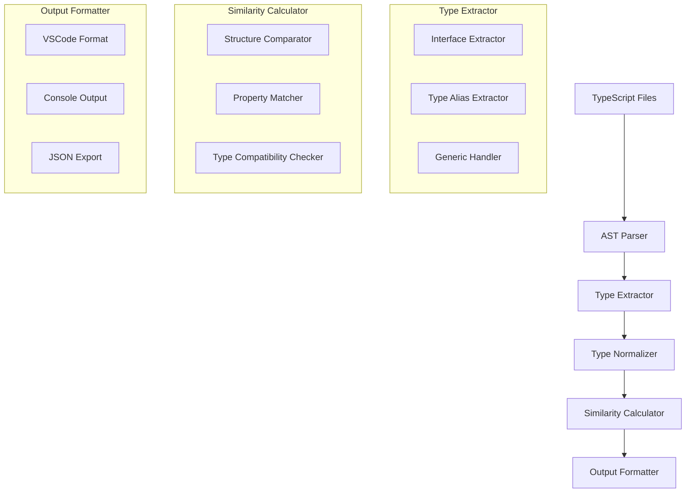
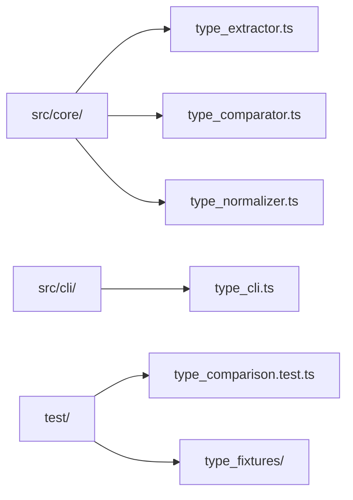

# TypeScript å‹å®šç¾©é¡ä¼¼æ€§æ¯”較機能 - 設計書

## 📋 概è¦

既存ã®é–¢æ•°æ¯”較機能ã«åŠ ãˆã¦ã€TypeScript ã® `type` 㨠`interface` 宣言ã®æ§‹é€ çš„é¡ä¼¼æ€§ã‚’評価ã™ã‚‹æ©Ÿèƒ½ã‚’追加ã—ã¾ã™ã€‚

## 🯠設計目標

1. **既存機能ã¨ã®çµ±åˆ**: 関数比較ã¨åŒæ§˜ã®ãƒ¯ãƒ¼ã‚¯ãƒ•ãƒ­ãƒ¼ã§å‹•ä½œ
2. **段éšçš„実装**: 基本å‹ã‹ã‚‰å§‹ã‚ã¦è¤‡é›‘ãªå‹ã¸æ‹¡å¼µ
3. **柔軟ãªé¡ä¼¼æ€§è©•ä¾¡**: プロパティ順åºã‚„命åã®é•ã„を許容
4. **VSCode 互æ›å‡ºåŠ›**: `similar-type:` ラベル付ãコンソール出力

## ğŸ—ï¸ ã‚¢ãƒ¼ã‚­ãƒ†ã‚¯ãƒãƒ£è¨­è¨ˆ


```mermaid
graph TB
    A[TypeScript Files] --> B[AST Parser]
    B --> C[Type Extractor]
    C --> D[Type Normalizer]
    D --> E[Similarity Calculator]
    E --> F[Output Formatter]

    subgraph "Type Extractor"
        C1[Interface Extractor]
        C2[Type Alias Extractor]
        C3[Generic Handler]
    end

    subgraph "Similarity Calculator"
        E1[Structure Comparator]
        E2[Property Matcher]
        E3[Type Compatibility Checker]
    end

    subgraph "Output Formatter"
        F1[VSCode Format]
        F2[Console Output]
        F3[JSON Export]
    end
```

## 📠ファイル構æˆ


```mermaid
graph LR
    A[src/core/] --> B[type_extractor.ts]
    A --> C[type_comparator.ts]
    A --> D[type_normalizer.ts]

    E[src/cli/] --> F[type_cli.ts]

    G[test/] --> H[type_comparison.test.ts]
    G --> I[type_fixtures/]
```

## 🔧 実装計画

### Phase 1: 基本å‹å®šç¾©æŠ½å‡º (Week 1-2)

**æ–°è¦ãƒ•ã‚¡ã‚¤ãƒ«**: `src/core/type_extractor.ts`

```typescript
export interface TypeDefinition {
  name: string;
  kind: "interface" | "type";
  properties: PropertyDefinition[];
  generics?: string[];
  extends?: string[];
  ast: any;
  startLine: number;
  endLine: number;
  filePath: string;
}

export interface PropertyDefinition {
  name: string;
  type: string;
  optional: boolean;
  readonly?: boolean;
}
```

**主è¦æ©Ÿèƒ½**:

- `interface` 宣言ã®æŠ½å‡º
- `type` エイリアスã®æŠ½å‡º
- プロパティã¨ãã®å‹æƒ…å ±ã®è§£æ
- ジェãƒãƒªã‚¯ã‚¹ãƒ‘ラメータã®æŠ½å‡º

### Phase 2: å‹æ­£è¦åŒ–ã¨ãƒãƒƒãƒãƒ³ã‚° (Week 2-3)

**æ–°è¦ãƒ•ã‚¡ã‚¤ãƒ«**: `src/core/type_normalizer.ts`

```typescript
export interface NormalizedType {
  properties: Map<string, string>; // プロパティå -> å‹
  optionalProperties: Set<string>;
  readonlyProperties: Set<string>;
  signature: string; // æ­£è¦åŒ–ã•ã‚ŒãŸå‹ã‚·ã‚°ãƒãƒãƒ£
}

export function normalizeType(typeDef: TypeDefinition): NormalizedType;
export function calculatePropertySimilarity(
  prop1: string,
  prop2: string
): number;
```

**主è¦æ©Ÿèƒ½**:

- プロパティ順åºã®æ­£è¦åŒ–
- å‹åã®æ­£è¦åŒ–（`string` vs `String`ãªã©ï¼‰
- プロパティåã®é¡ä¼¼æ€§è¨ˆç®—（Levenshtein è·é›¢ãƒ™ãƒ¼ã‚¹ï¼‰

### Phase 3: é¡ä¼¼æ€§è©•ä¾¡ã‚¢ãƒ«ã‚´ãƒªã‚ºãƒ  (Week 3-4)

**æ–°è¦ãƒ•ã‚¡ã‚¤ãƒ«**: `src/core/type_comparator.ts`

```typescript
export interface TypeComparisonResult {
  similarity: number;
  structuralSimilarity: number;
  namingSimilarity: number;
  differences: {
    missingProperties: string[];
    extraProperties: string[];
    typeMismatches: Array<{ property: string; type1: string; type2: string }>;
    optionalityDifferences: string[];
  };
}

export function compareTypes(
  type1: TypeDefinition,
  type2: TypeDefinition,
  options?: TypeComparisonOptions
): TypeComparisonResult;
```

**é¡ä¼¼æ€§è¨ˆç®—å¼**:

```
ç·åˆé¡ä¼¼æ€§ = (構造é¡ä¼¼æ€§ × 0.6) + (命åé¡ä¼¼æ€§ × 0.4)

構造é¡ä¼¼æ€§ = (共通プロパティ数 × 2) / (type1プロパティ数 + type2プロパティ数)
命åé¡ä¼¼æ€§ = Σ(プロパティåé¡ä¼¼åº¦) / プロパティ数
```

### Phase 4: CLI çµ±åˆ (Week 4-5)

**既存ファイル拡張**: `src/cli/cli.ts`

æ–°ã—ã„オプション追加:

```bash
similarity-ts ./src --include-types
similarity-ts ./src --types-only
similarity-ts ./src --type-threshold 0.8
```

**出力フォーãƒãƒƒãƒˆ**:

```
🔠TypeScript Type Similarity Analyzer

Found 15 similar type pairs:

🔴 Very High Similarity (≥90%):
  ├─ interface User in models/user.ts:5
  └─ interface Person in models/person.ts:12
     92.5% similar

🟡 High Similarity (80-90%):
  ├─ type ApiResponse<T> in api/types.ts:8
  └─ interface Response in utils/http.ts:15
     85.3% similar
```

### Phase 5: ユニオンå‹ãƒ»ã‚¤ãƒ³ã‚¿ãƒ¼ã‚»ã‚¯ã‚·ãƒ§ãƒ³å‹å¯¾å¿œ (Week 5-6)

**拡張機能**:

- ãƒ¦ãƒ‹ã‚ªãƒ³å‹ (`"active" | "inactive"`) ã®è§£æ
- ã‚¤ãƒ³ã‚¿ãƒ¼ã‚»ã‚¯ã‚·ãƒ§ãƒ³å‹ (`A & B`) ã®è§£æ
- 複åˆå‹ã®é¡ä¼¼æ€§è©•ä¾¡

## 🧪 テスト戦略

### テストケース設計

**基本é¡ä¼¼æ€§ãƒ†ã‚¹ãƒˆ**:

```typescript
// 高é¡ä¼¼åº¦ (90%+)
interface User {
  id: string;
  name: string;
}
interface Person {
  id: string;
  name: string;
}

// 中é¡ä¼¼åº¦ (70-90%)
interface User {
  id: string;
  name: string;
}
interface Person {
  id: string;
  fullName: string;
}

// ä½é¡ä¼¼åº¦ (<70%)
interface User {
  id: string;
  name: string;
}
interface Product {
  sku: string;
  price: number;
}
```

**異種比較テスト**:

```typescript
type UserType = { id: string; name: string };
interface UserInterface {
  id: string;
  name: string;
}
// 期待値: 95%+ é¡ä¼¼
```

## 🔄 既存機能ã¨ã®çµ±åˆ

### 1. パーサー統åˆ

既存㮠`parseTypeScript` 関数を活用

### 2. AST 走査統åˆ

既存㮠`traverseAST` インフラを拡張

### 3. 出力統åˆ

既存ã®é–¢æ•°æ¯”較çµæœã¨å‹æ¯”較çµæœã‚’çµ±åˆè¡¨ç¤º

## 📊 パフォーãƒãƒ³ã‚¹è€ƒæ…®äº‹é …

### メモリ使用é‡å¯¾ç­–

- 既存㮠APTED 実装ã«ãƒ¡ãƒ¢ãƒªãƒªãƒ¼ã‚¯å•é¡ŒãŒã‚ã‚‹ãŸã‚ã€å‹æ¯”較ã§ã¯è»½é‡ãªã‚¢ãƒ«ã‚´ãƒªã‚ºãƒ ã‚’使用
- 大é‡ã®å‹å®šç¾©ãŒã‚ã‚‹å ´åˆã®ãƒãƒƒãƒå‡¦ç†æœ€é©åŒ–

### 処ç†é€Ÿåº¦æœ€é©åŒ–

- å‹ã‚·ã‚°ãƒãƒãƒ£ã®ãƒãƒƒã‚·ãƒ¥åŒ–ã«ã‚ˆã‚‹é«˜é€Ÿæ¯”較
- æ˜ã‚‰ã‹ã«ç•°ãªã‚‹å‹ã®æ—©æœŸé™¤å¤–

## 🚀 実装優先順ä½

1. **高優先度**: 基本的㪠interface/type 抽出ã¨æ¯”較
2. **中優先度**: ユニオンå‹ãƒ»ã‚¤ãƒ³ã‚¿ãƒ¼ã‚»ã‚¯ã‚·ãƒ§ãƒ³å‹å¯¾å¿œ
3. **ä½å„ªå…ˆåº¦**: ジェãƒãƒªã‚¯ã‚¹ã€æ¡ä»¶å‹ã€ãƒãƒƒãƒ—å‹å¯¾å¿œ

## 📠æˆæœç‰©

1. **コア機能**:

   - `src/core/type_extractor.ts`
   - `src/core/type_comparator.ts`
   - `src/core/type_normalizer.ts`

2. **CLI çµ±åˆ**:

   - `src/cli/cli.ts` ã®æ‹¡å¼µ

3. **テスト**:

   - `test/type_comparison.test.ts`
   - テストフィクスãƒãƒ£ãƒ•ã‚¡ã‚¤ãƒ«ç¾¤

4. **ドキュメント**:
   - API 仕様書
   - 使用例ã¨ãƒ™ã‚¹ãƒˆãƒ—ラクティス

## 🯠è¦ä»¶è©³ç´°

### é¡ä¼¼æ€§è©•ä¾¡åŸºæº–

- プロパティã®é †åºã‚„命åãŒç•°ãªã£ã¦ã‚‚ã€å‹ã®æ§‹é€ ãŒåŒã˜å ´åˆã¯é¡ä¼¼ã¨åˆ¤å®š
- プロパティå㌠80%以上一致ã—ã€å‹æ§‹é€ ãŒé¡ä¼¼ã—ã¦ã„ã‚‹å ´åˆã‚‚é¡ä¼¼ã¨åˆ¤å®š
- `type` 㨠`interface` é–“ã®æ¯”較も対応

### 対応ã™ã‚‹å‹å®šç¾©

- 基本的ãªã‚ªãƒ–ジェクトå‹ã¨ãƒ—リミティブå‹
- ユニオンå‹ã¨ã‚¤ãƒ³ã‚¿ãƒ¼ã‚»ã‚¯ã‚·ãƒ§ãƒ³å‹
- 段éšçš„実装ã«ã‚ˆã‚Šã€å¾Œã‹ã‚‰è¤‡é›‘ãªå‹å®šç¾©ã‚‚追加

### 出力形å¼

- VSCode 互æ›ã® `similar-type:` ラベル付ãコンソール出力
- 既存ã®é–¢æ•°æ¯”較機能ã¨çµ±åˆã•ã‚ŒãŸãƒ¯ãƒ¼ã‚¯ãƒ•ãƒ­ãƒ¼

ã“ã®è¨­è¨ˆã«ã‚ˆã‚Šã€æ—¢å­˜ã®é–¢æ•°æ¯”較機能ã¨ä¸€è²«æ€§ã‚’ä¿ã¡ãªãŒã‚‰ã€TypeScript å‹å®šç¾©ã®æ§‹é€ çš„é¡ä¼¼æ€§ã‚’効æœçš„ã«è©•ä¾¡ã§ãる機能を段éšçš„ã«å®Ÿè£…ã§ãã¾ã™ã€‚
